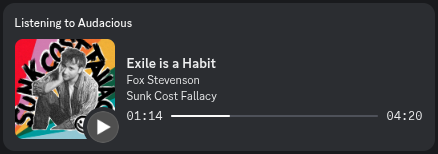

# Audacious Discord RPC

Discord Rich Presence (RPC) plugin for [Audacious][1]! \
Displays what you’re vibing to in your Discord profile. 🧑‍🎤🎶

<div align="center">
     
</div>

This is a modernisation hard-fork by [onegen][4] of [`darktohka/audacious-plugin-rpc`][3]
(made in 2018, abandoned in 2022) by [DarkTohka][5] [et al.][11] \
It migrates the plugin from the deprecated [`discord/discord-rpc`][6]
to the modernised [`EclipseMenu/discord-presence`][12], allowing it to use
the new `LISTENING` activity type (“Listening to...”) and a progress bar.

**Original (v1.x):**


**This Fork (v2):**


**This Fork + Experimental ‘Fetch Cover Art’ Option (WiP):**



<sub><i>Note: Cover art fetching is experimental, unstable and WiP. It is available as an opt-in setting in [pre-releases](https://github.com/onegentig/audacious-discord-rpc/releases) (since v2.2-pre2511A). Covers are fetched from [MusicBrainz][15] ([CAA][16]).</i></sub>

## Installation

> [!NOTE]
> It is *not possible* to install this plugin on sandboxed immutable
> distributions of Audacious like Flatpak or Snap.

This plugin is not included in the official [Audacious plugins][13], so it has to be
added to the Audacious plugin directory manually. Audacious is usually installed
system-wide, so administrator privilages will likely be required. \
Plugin is compiled for Linux and Windows (10+).

1. **Get the `discord-rpc` plugin file.** In the [releases][2] section, see the
     latest version – a ZIP file with the compiled plugin should be available
     for Linux and Windows. Releases labeled "Pre-Release" have yet-untested
     features and might cause crashes – if that sounds bad to you, stick to
     "Latest". :)

     The plugin file is `discord-rpc.so` for Linux and
     `discord-rpc.dll` for Windows.

2. **Find the plugin directory.** More specific notes on finding it are in the included
     `INSTALL.*.txt`. On Linux, you can find the directory via `pkg-config` if you
     installed Audacious as a system package:

     ```sh
     echo "$(pkg-config --variable=plugin_dir audacious)/General"
     ```

     On Windows, it depends on where you installed the music player.
     The default location is `C:\Program Files (x86)\Audacious`.
     The plugin directory is within that installation folder in
     `lib\audacious\General` subdirectory, so with the default root:
     `C:\Program Files (x86)\Audacious\lib\audacious\General`.

     On all platforms it should be called ‘General’ and be filled with
     other default plugins (`.so` or `.dll` files).

3. **Copy the plugin there.** Once you found the directory, copy the
     `discord-rpc.{so,dll}` file there. You’ll likely need administrator
     (sudo) privilages if installed system-wide. A shortcut for
     Linux users:

     ```sh
     sudo cp ~/Downloads/discord-rpc.so $(pkg-config --variable=plugin_dir audacious)/General/
     ```

4. **Enable the plugin.** In Audacious, open ‘Services’ on the top menu, then
     open ‘Plug-Ins’ and in the ‘General’ tab, you should see ‘Discord RPC’ as shown
     on the screenshot below. Checking the box will enable the plugin. The plugin has
     a few configurable options, which you can change by clicking ‘Settings’ with the
     plugin highlighted.


If you encounter any issues or crashes, please, open an [issue][10]! I *want* this to work so
if something is broken, I’ll do my best to fix it. Alternatively, if you’re good with C++,
and feel like helping out, check if you can’t fix something yourself. PRs are always appreciated! ❤️

This plugin prints a good amount of debug info when enabled. To specifically see only
the plugin’s logs, run Audacious from a terminal like so:

```sh
audacious -VV 2>&1 | grep --line-buffered -i 'RPC'
```

```nushell
audacious -VV o+e>| grep --line-buffered -i 'RPC' # for nushell
```

### Uninstallation

To uninstall the plugin, simply delete the `discord-rpc.so` file from the Audacious
‘General’ plugins directory (see step 2 of [Installation](#installation) above).
A quick shell command:

```sh
sudo rm $(pkg-config --variable=plugin_dir audacious)/General/discord-rpc.so
```

Also, if you used the [older (original) version][3] of the plugin (pre-fork), you
might want to delete that, too. The older file was called `libaudacious-plugin-rpc.so`.

```sh
sudo rm $(pkg-config --variable=plugin_dir audacious)/General/libaudacious-plugin-rpc.so
```

## Building

**TODO:** I will make a more proper building guide later. If you ever used CMake before though,
it is rather standard. On Linux, you need `audacious-dev` (DEB) / `audacious-devel` (RPM)
package installed system-wide (Audacious headers) as well as cURL, git and CMake. \
On Windows, compilation is possible only on [MSYS2](https://www.msys2.org) MINGW64 environment
and you’ll need something like this (may be incomplete):

```bash
pacman -Syu
pacman -S base-devel git mingw-w64-x86_64-toolchain mingw-w64-x86_64-gcc mingw-w64-x86_64-glib2 mingw-w64-x86_64-cmake mingw-w64-x86_64-pkg-config
```

After that, it’s just a matter of this: (both platforms)

```bash
cmake -S . -B build -DCMAKE_BUILD_TYPE=Release
cmake --build build -j
sudo cmake --install build # optionally copies to General, if found
```

## Licence


This is a free and open-source software, licensed under the [MIT licence][8].

- <span title="Too long; didn’t read; not a lawyer">TL;DR;NAL</span>: Do absolutely whatever you want with the code, just include the LICENCE file if you re-distribute it.
- See [`LICENCE`](./LICENCE) file or [tl;drLegal][9] for more details.

## Credits

- [onegen][4]&thinsp;–&thinsp;developer of this continuation fork
- [Derzsi “DarkTohka” Dániel][5], [et al.][11]&thinsp;–&thinsp;developers of the original plugin
- [Олександр “Prevter” Немеш][14]&thinsp;–&thinsp;developer of [`discord-presence`][12], the used Discord RPC library
- and additionally all the Discord & Audacious developers and contritutors.

[1]: https://audacious-media-player.org "Audacious Homepage"
[2]: https://github.com/onegentig/audacious-discord-rpc/releases "Audacious Discord RPC (fork) Releases"
[3]: https://github.com/darktohka/audacious-plugin-rpc "Audacious Discord RPC (original, abandoned) by D. Dániel"
[4]: https://github.com/onegentig "onegen on GitHub"
[5]: https://github.com/darktohka "Derzsi Dániel (DarkTohka) on GitHub"
[6]: https://github.com/discord/discord-rpc "Discord RPC Library (deprecated)"
[8]: https://en.wikipedia.org/wiki/MIT_License "MIT Licence on Wikipedia"
[9]: https://www.tldrlegal.com/license/mit-license "MIT Licence on tl;drLegal"
[10]: https://github.com/onegentig/audacious-discord-rpc/issues "Audacious Discord RPC (fork) Issues"
[11]: https://github.com/darktohka/audacious-plugin-rpc/graphs/contributors "Audacious Discord RPC (original) contributors"
[12]: https://github.com/EclipseMenu/discord-presence "discord-presence library by O. Nemeš"
[13]: https://github.com/audacious-media-player/audacious-plugins "Official Audacious Plugins repository"
[14]: https://github.com/Prevter "Олександр Немеш (Prevter) on GitHub"
[15]: https://musicbrainz.org "MusicBrainz (official website)"
[16]: https://musicbrainz.org/doc/Cover_Art_Archive "Cover Art Archive in MusicBrainz Documentation"
