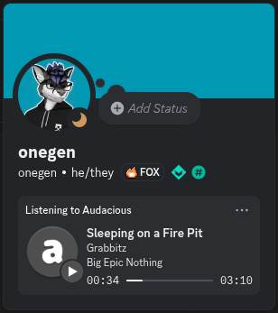
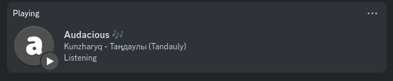
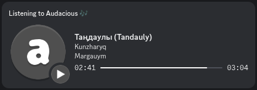
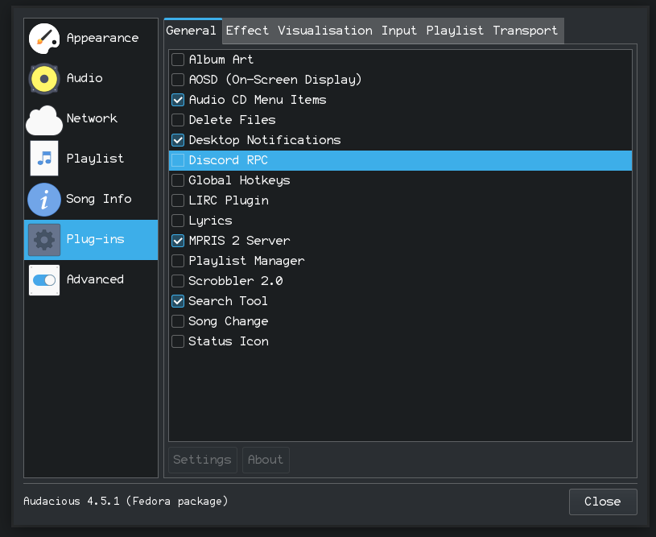
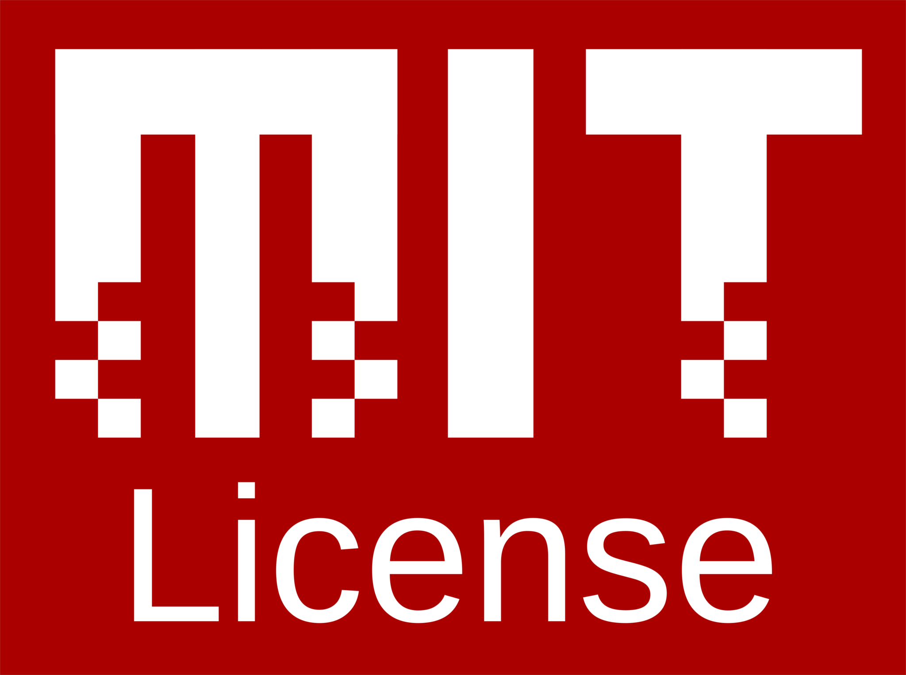

# Audacious Discord RPC

Discord Rich Presence (RPC) plugin for [Audacious][1]! \
Displays what you’re vibing to in your Discord profile. 🧑‍🎤🎶

<div align="center">
     
</div>

This is a modernisation fork by [onegen][4] of [`darktohka/audacious-plugin-rpc`][3]
(made in 2018, abandoned in 2022) by [Derzsi Dániel][5] [et al.][11] \
It migrates the plugin from the deprecated [`discord/discord-rpc`][6]
to the modernised [`EclipseMenu/discord-presence`][12], allowing it to use
the new `LISTENING` activity type (“Listening to...”) and a progress bar.

**Before:**



**After:**



## Installation

> [!NOTE]
> This plugin is *made for GNU/Linux* systems and is not tested for Windows or Mac.
> Furthermore, it is *not possible* to install this plugin on sandboxed immutable
> distributions of Audacious like Flatpak or Snap.

This plugin is not included in the official [Audacious plugins][13], so it has to be
added to the Audacious plugin directory manually. Audacious is usually installed
system-wide, so administrator privilages will likely be required.

1. **Get the `discord-rpc.so` file.** You can find the latest
     released version in the [releases][2] section. Alternatively, you can
     build it from source yourself (req. `audacious-dev` aka `audacious-devel`
     installed system-wide):

     ```sh
     git clone git@github.com:onegentig/audacious-discord-rpc.git
     cd audacious-discord-rpc
     cmake -S . -B build
     cmake --build build -j # Built file: build/discord-rpc.so
     ```

2. **Find the plugin directory.** (Not necessary for manual builds, see below.)
     Run the following command to find out where to put the plugin file:

     ```sh
     echo "$(pkg-config --variable=plugin_dir audacious)/General"
     ```

     Or if you’re using nushell:

     ```nushell
     $"(pkg-config --variable=plugin_dir audacious)/General"
     ```

     As it will likely print a system directory in `/usr`,
     moving the plugin fill will require admin privilages.

3. **Move the file.** If you downloaded the `discord-rpc.so` from a release,
     move the file to the directory from the previous step. Simple `cp`:

     ```sh
     sudo cp ~/Downloads/discord-rpc.so $(pkg-config --variable=plugin_dir audacious)/General/
     ```

     If you built the plugin yourself, run this command instead:

     ```sh
     sudo cmake --install build
     ```

     This internally calls the `pkg-config` command and does it all for you. Big thanks to
     [Sturmlilie](https://github.com/Sturmlilie) for implementing this!

4. **Enable the plugin.** In Audacious, open ‘Services’ on the top menu, then
     open ‘Plug-Ins’ and in the ‘General’ tab, you should see ‘Discord RPC’ as shown
     on the screenshot below. Checking the box will enable the plugin. The plugin has
     a few configurable options, which you can change by clicking ‘Settings’ with the
     plugin highlighted.



If you encounter any issues or crashes, please, open an [issue][10]! I *want* this to work so
if something is broken, I’ll do my best to fix it. Alternatively, if you’re good with C++,
and feel like helping out, check if you can’t fix something yourself. PRs are always appreciated! ❤️

### Uninstallation

To uninstall the plugin, simply delete the `discord-rpc.so` file from the Audacious
“General plugins” directory (see step 2 of [Installation](#installation) above).
A quick shell command:

```sh
sudo rm $(pkg-config --variable=plugin_dir audacious)/General/discord-rpc.so
```

…on nushell:

```nushell
sudo rm $"(pkg-config --variable=plugin_dir audacious)/General/discord-rpc.so"
```

Also, if you used the [older (original) version][3] of the plugin (pre-fork), you
might want to delete that file too. The older file was called `libaudacious-plugin-rpc.so`.

```sh
sudo rm $(pkg-config --variable=plugin_dir audacious)/General/libaudacious-plugin-rpc.so
```

…on nushell:

```nushell
sudo rm $"(pkg-config --variable=plugin_dir audacious)/General/libaudacious-plugin-rpc.so"
```

## Licence



This is a free and open-source software, licensed under the [MIT licence][8].

- <span title="Too long; didn’t read; not a lawyer">TL;DR;NAL</span>: Do absolutely whatever you want with the code, just include the LICENCE file if you re-distribute it.
- See [`LICENCE`](./LICENCE) file or [tl;drLegal][9] for more details.

## Credits

- [onegen](https://github.com/onegentig)&thinsp;–&thinsp;RPC modernisation + fork maintanance
- [Derzsi Dániel][5] [et al.][11]&thinsp;–&thinsp;creators of the original plugin
- [Олександр Немеш](https://github.com/Prevter)&thinsp;–&thinsp;creator of [`discord-presence`][12], the used Discord RPC library
- and additionally all the Discord and Audacious developers and contritutors.

[1]: https://audacious-media-player.org "Audacious Homepage"
[2]: https://github.com/onegentig/audacious-discord-rpc/releases "Audacious Discord RPC (fork) Releases"
[3]: https://github.com/darktohka/audacious-plugin-rpc "Audacious Discord RPC (original, abandoned) by D. Dániel"
[4]: https://github.com/onegentig "onegen on GitHub"
[5]: https://github.com/darktohka "Derzsi Dániel (DarkTohka) on GitHub"
[6]: https://github.com/discord/discord-rpc "Discord RPC Library (deprecated)"
[8]: https://en.wikipedia.org/wiki/MIT_License "MIT Licence on Wikipedia"
[9]: https://www.tldrlegal.com/license/mit-license "MIT Licence on tl;drLegal"
[10]: https://github.com/onegentig/audacious-discord-rpc/issues "Audacious Discord RPC (fork) Issues"
[11]: https://github.com/darktohka/audacious-plugin-rpc/graphs/contributors "Audacious Discord RPC (original) contributors"
[12]: https://github.com/EclipseMenu/discord-presence "discord-presence library by O. Nemeš"
[13]: https://github.com/audacious-media-player/audacious-plugins "Official Audacious Plugins repository"
