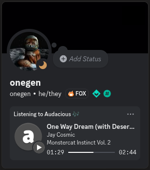

# Audacious Discord RPC

Discord Rich Presence (RPC) plugin for [Audacious][1]! \
Displays what you’re vibing to in your Discord profile. 🧑‍🎤🎶

<div align="center">
     
</div>

This is a modernisation fork by [onegen][4] of [`darktohka/audacious-plugin-rpc`][3],
(made in 2018, abandoned in 2022) by [Derzsi Dániel][5] et al.
It migrates the IPC protocol and header from the deprecated [`discord/discord-rpc`][6]
to the newer [Discord Game SDK][7].\
With the new SDK, it can make use of the new `LISTENING` activity type,
showing a progress bar and “Listening to Audacious” status.

**Before:**


**After:**


## Installation

```sh
git clone git@github.com:onegentig/audacious-discord-rpc.git
cd audacious-discord-rpc
mkdir build
cd build
cmake ..
sudo make install
```

## Licence


This program is a free and source-available software,
with the fork’s additions open-sourced under the [MIT licence][8].

- <span title="Too long; didn’t read; not a lawyer">TL;DR;NAL</span>: Do absolutely whatever you want with the code, just include the LICENCE file if you re-distribute it.
- See [`LICENCE`](./LICENCE) file or [tl;drLegal][9] for more details.

The code from the [original repository][3] is *without a licence*.
The author(s) [have been asked][10] to add one, but the repository is effectively abandoned
and my the request was ignored (at the time of writing). \
In general, code related to Discord RPC/IPC is [this fork][2]’s own work (MIT)
while code registering the plugin with Audacious is from the original repository (unlicensed).

## Credits

- [onegen](https://github.com/onegentig)&thinsp;–&thinsp;RPC modernisation + fork maintanance
- [Derzsi Dániel](https://github.com/darktohka) [et al.][11]&thinsp;–&thinsp;creators of the original plugin
- [Олександр Немеш](https://github.com/Prevter)&thinsp;–&thinsp;creator of [`discord-presence`][12], the used Discord RPC library
- and additionally all the Discord and Audacious developers and contritutors.

[1]: https://audacious-media-player.org "Audacious Homepage"
[2]: https://github.com/onegentig/audacious-plugin-rpc "Audacious Discord RPC (2024 fork) by onegen"
[3]: https://github.com/darktohka/audacious-plugin-rpc "Audacious Discord RPC (original, abandoned) by D. Dániel"
[4]: https://github.com/onegentig "onegen on GitHub"
[5]: https://github.com/darktohka "Derzsi Dániel (DarkTohka) on GitHub"
[6]: https://github.com/discord/discord-rpc "Discord RPC Library (deprecated)"
[7]: https://discord.com/developers/docs/rich-presence/using-with-the-game-sdk "Discord Game SDK documentation"
[8]: https://en.wikipedia.org/wiki/MIT_License "MIT Licence on Wikipedia"
[9]: https://www.tldrlegal.com/license/mit-license "MIT Licence on tl;drLegal"
[10]: https://github.com/darktohka/audacious-plugin-rpc/issues/15 "Issue #15: Add a Licence"
[11]: https://github.com/darktohka/audacious-plugin-rpc/graphs/contributors "Audacious Discord RPC (original) contributors"
[12]: https://github.com/EclipseMenu/discord-presence "discord-presence library by O. Nemeš"
